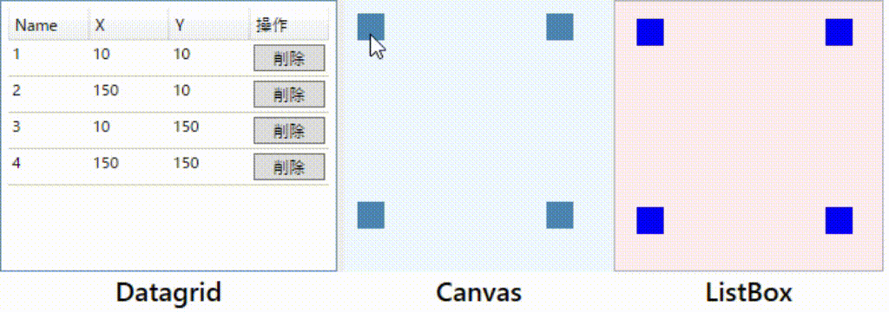

# wpf ドラッグ移動サンプル

MVVM Bindingサンプル。

- WPF / .NET 6.0 
- MVVMライブラリ未利用。MvvmUtilsフォルダに単純なものを用意。
- `RectInfo`というデータクラスでRectangleを管理
- Canvas上のUIElementをドラッグ移動させるとDataGridに反映。
- 逆方向も反映

 

## 更新

サンプルなのでよりより平易になるように変更しています。

### ver 1.2

- MyCanvasをUserControlではなくCanvas派生に変更
- モデル、ViewModelをフォルダに移動
- ListBoxの選択状態表示をCanvasに合わせるようXAML調整

### ver 1.1（公開時）

- フォルダをやめて平坦に。
- 削除ボタンをコマンド化。
- ファイル数削減。
- DataGridをMainWindow内に直接配置。これにより`SelectedItem`プロパティをDataGridとCanvas間で直接Bindingするように変更、ViewModel管理をやめた。
- データ管理(Model)をMyDataクラスに分離
